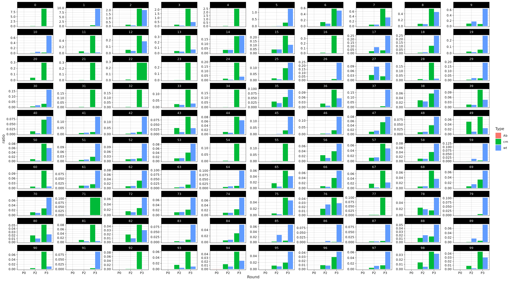
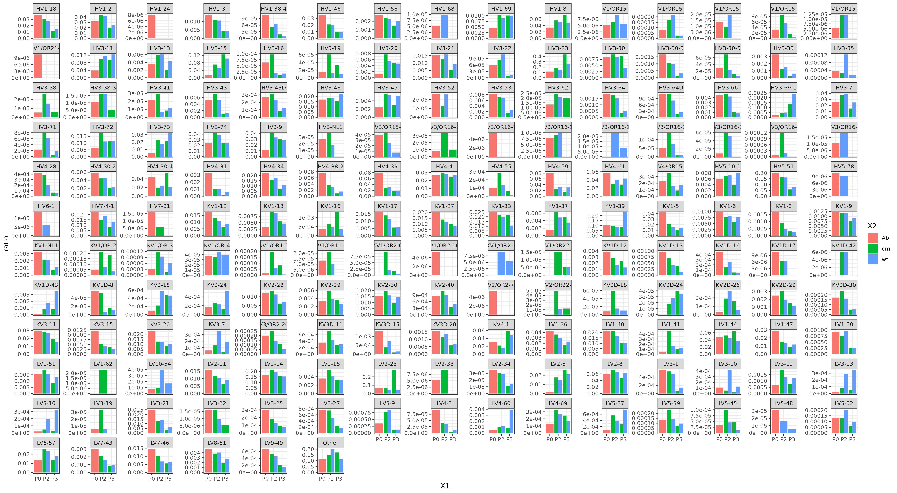
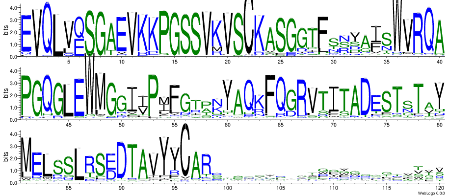

# miniHA_Abs_Phage_Screen

## General Pipeline
- [x] Integration of Fastq files
- [x] Flank sequence trim
- [x] Removal of redundancy and marking of duplications
- [x] Top list for the AntiBody 
- [x] Blast analysis of L/H chain
- [x] Counting of reads
- [ ] Analysis of variations
- [x] exponential regression
- [ ] wt and cm co-association


# Integration

After integration, the total number of reads are:

| Sample     | Counts  |
|------------|--------|
| P0_Ab| 377573 |
| P2_cm| 330712 |
| P2_wt| 310041 |
| P3_cm| 397649 |
| P3_wt| 357229 |

# Flank sequence trim


Ps-r: 5’-3’ TTCAGttcaggaggaatttaaaatgaaaaagac
ps-f: 5’-3’ AGCTATGACCCACTCTTTCAACAGTCTTATCGTCATCG

Reads without Flank sequence:

TTCAGttcaggaggaatttaaaatgaaaaagac
TTCAGTTCAGGAGGAATTTAAAATGAACCTATTGCCTACGGCAGCCGCTGGATTGT

AGCTATGACCCACTCTTTCAACAGTCTTATCGTCATCG
AGCTATGACCCACTCAAGCCCCTTCCCTGGAGCCTGGCGGACCCAG


## Trimmed result

Untrimmed: 8494
Trimmed:  1,764,710
~ 0.47%

# Mark duplication

`[INFO] 608562 duplicated records removed`

# Statistic result

## total
|Sample|Counts|
|:-|:-|
 P0_Ab| 375990
 P2_cm| 329090
 P2_wt| 307941
 P3_cm| 395761
 P3_wt| 355928

## Duplicated reads

|Reads ID| Sample | Counts|
|:-|:-|:-|
0 |P0_Ab| 3
0| P2_cm| 324
0| P2_wt| 32
0| P3_cm| 36503
0| P3_wt| 75
1| P2_cm| 43
1| P2_wt| 90
1| P3_cm| 1989
1| P3_wt| 34175
2| P2_cm| 579

# ratio matrix



# Find the link sequence

`ttctagataattaattaggaggaatttaaaatgaaatacctattgcctacggcagccgctggattgttattactcgctgcccaaccagccatggcc`
Found the link sequence in 1154584 reads from 1156148 reads.

# split the reads 

split the reads into up & down independent sequences if the link sequences if the link is found. If not, keep the full sequence.

Result: 2310732 sequence in library

# blast the reads to the IG library

```
Splitting input fasta file ../PacBio/clean_split.fa
2,245,021 sequences successfully split into 2310 pieces
Starting process pool using 62 processors
2310723seq [44:49, 859.14seq/s]                              
2,245,021 sequences processed in 2,695.56 seconds, 832 sequences / s
Zipping up final output
Analysis complete, result file: Result/clean.tsv.gz
```
Result: 6.2G tsv file

# Families




# Seqlogo


```
options:
  -h, --help            show this help message and exit
  -i INPUT [INPUT ...], -I INPUT [INPUT ...], --input INPUT [INPUT ...]
                        input the annotated blast results. It is a list. You could input the Cleared results only. But if you want
                        to cont the ratio, please add the duplicated annotation result, too.
  -o OUTPUT, -O OUTPUT, --output OUTPUT
                        Please remember that the output is a directory
  -fv VFAMILY [VFAMILY ...], -FV VFAMILY [VFAMILY ...], --vfamily VFAMILY [VFAMILY ...]
  -t [TOP], -T [TOP], --top [TOP]
  -s SAMPLE [SAMPLE ...], -S SAMPLE [SAMPLE ...], --sample SAMPLE [SAMPLE ...]
  -p PSTAGE [PSTAGE ...], -P PSTAGE [PSTAGE ...], --pstage PSTAGE [PSTAGE ...]

Usage:
python scripts/I_Can_Do_all.py -i {Input annotated results}  -O '{Output directory} -s {samples} -p {stages} -t {number for top}

Example:
python scripts/I_Can_Do_all.py -i PacBio/clean.tsv.gz PacBio/Duplicated.tsv.gz  -O Result/SeqLogo -s wt cm -p P2 P3 -t 100 -f IGHV1-69 IGHV3-21
```

```bash
python scripts/I_Can_Do_all.py -i PacBio/clean.tsv.gz PacBio/Duplicated.tsv.gz  -O Result/SeqLogo -s 'Ab'
```